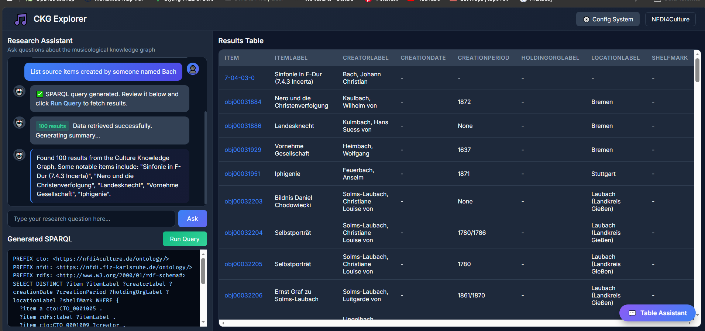
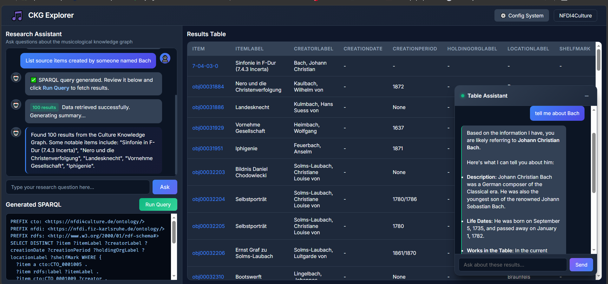
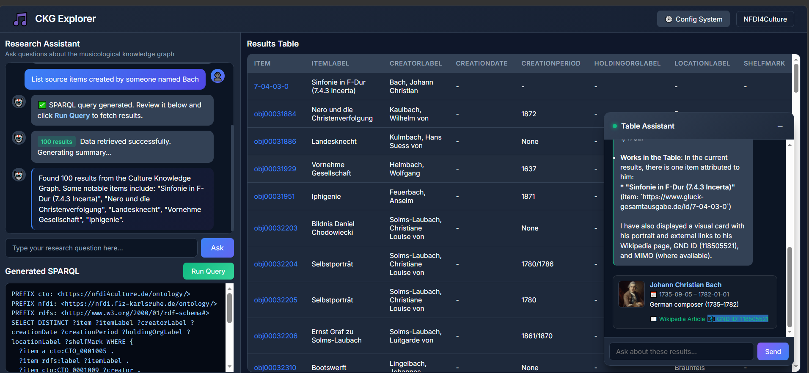
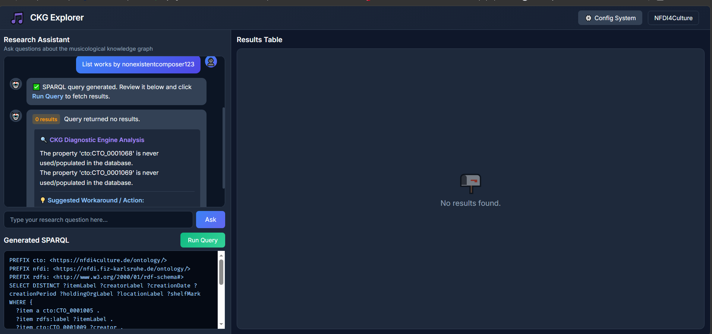
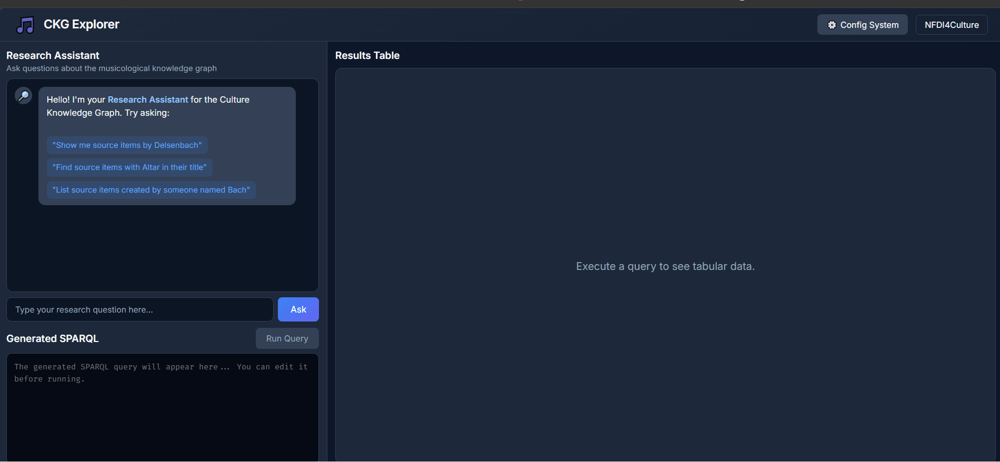

# CKG Explorer: A Conversational Semantic Web Interface

**CKG Explorer** is an intelligent, dynamic interface built for the **NFDI4Culture Knowledge Graph (CKG)**. Designed to bridge the gap between complex semantic web technologies and human researchers, this platform translates natural language into precise SPARQL queries, visualizes tabular data, and provides deep, real-time interoperability with external Linked Open Data (LOD) sources.



---

##  The Challenge vs. The Solution

Querying a massive knowledge graph usually requires strict knowledge of SPARQL syntax and underlying ontologies. **CKG Explorer** eliminates this barrier. Researchers can type questions in natural language, and the system handles the ontological mapping, syntax generation, and error handling autonomously.

---

##  Key Features & UI Breakdown

### 1. Transparent & Editable SPARQL Generation
When a researcher asks a question, the system generates the corresponding SPARQL query. Instead of running it blindly in the background, the query is displayed in an **editable text area**. This provides full transparency and allows experienced users to manually tweak the SPARQL code before executing it against the CKG endpoint.

### 2. The "Table Assistant" (LOD Interoperability)
The platform features an integrated, floating conversational assistant with two primary functions:
- **Internal Data Mining**: For large result tables, you can ask the assistant to analyze, filter, or summarize the displayed data.
- **External LOD Resolution**: The assistant cross-references entities in real-time. By connecting directly to the Wikidata API, it resolves entities and displays rich biography cards containing direct links to the **Gemeinsame Normdatei (GND)**, **MIMO (Musical Instrument Museums Online)**, and **Wikipedia**.

<p align="center">
  
  &nbsp; &nbsp;
  
</p>

### 3. Zero-Result Diagnostic Engine
Failing silently is the biggest flaw of traditional graph retrieval systems. We engineered a **Zero-Result Diagnostic Engine** that catches empty return sets, analyzes the schema structure, and identifies if the user's search filter (e.g., a specific composer's name) is simply missing from the database. It then suggests valid, existing entities as alternative "Pro Workarounds."



---

##  Workflow Demonstration

Watch the system in action: translating a natural language request, generating editable SPARQL, populating the results table, and utilizing the Table Assistant for external entity resolution.



---

##  Automated Edge-Case Validation (Jury Testing Suite)

To ensure maximum fault-tolerance, the repository includes `jury_simulation_test.py`. This automated test suite simulates edge-case user inputs, validates dynamic authority linking (GND/MIMO), and rigorously tests the Zero-Result Diagnostic Engine. It proves to developers and reviewers that the system handles unexpected inputs gracefully and maintains a 100% success rate under varied conditions.

---

##  Data Sources & Interoperability

This project actively queries and links the following semantic web sources:
1. **NFDI4Culture Knowledge Graph (CKG)**: Accessed via the official SPARQL endpoint (`https://sparql.nfdi4culture.de/`) to retrieve source items, persons, and locations.
2. **Wikidata API**: Used for real-time Linked Open Data (LOD) resolution to fetch **GND IDs** (German National Library) and **MIMO IDs** (Musical Instruments).

---

##  Installation & Execution

This platform is highly flexible, supporting both cloud-based APIs and fully local execution environments. 

### Installation & Setup

* **Prerequisites:** Python 3.10.9 (or Python 3.10+) is recommended.

1. **Clone the repository** and navigate into the project directory:
   ```bash
   git clone https://github.com/FiveElders/ckg-explorer.git
   cd ckg-explorer
   ```

2. **Create and activate a virtual environment** (recommended):
   * **Windows**:
     ```bash
     python -m venv venv
     venv\Scripts\activate
     ```
   * **macOS/Linux**:
     ```bash
     python -m venv venv
     source venv/bin/activate
     ```

3. **Install the dependencies**:
   ```bash
   pip install -r requirements.txt
   ```

### Option A: Cloud Execution (Google AI Studio)
If you lack the hardware infrastructure for local execution, you can leverage Google's Generative AI APIs. Google provides limited free-tier access to test their models, including state-of-the-art open-source variants.

> [!NOTE]
> This option is intended to run open-source models like Gemma (e.g., `gemma-4-31b-it` / `gemma-4-26b-a4b-it`) through Google AI Studio. Alternatively, you can run Gemini Flash (e.g., `gemini-2.5-flash`), which yields highly comparable results with faster execution.
1. Obtain an API Key from [Google AI Studio](https://aistudio.google.com/).
2. Provide your API key using **one of the following three simple methods**:
   
   * **Method 1: Via the Web UI (Recommended & Easiest)**
     * Launch the app (`python app.py`) and open `http://127.0.0.1:5050` in your browser.
     * Click the ⚙️ **Config System** button in the top right corner.
     * Enter your API Key in the **Cloud API Key** field and click **Save Config**.
   
   * **Method 2: Via Environment Variables (Safest for development)**
     * Set the `GOOGLE_API_KEY` variable before running the application:
       * **Windows (Command Prompt)**: `set GOOGLE_API_KEY=your_api_key_here`
       * **Windows (PowerShell)**: `$env:GOOGLE_API_KEY="your_api_key_here"`
       * **Linux/macOS (Terminal)**: `export GOOGLE_API_KEY="your_api_key_here"`
   
   * **Method 3: Direct Code Modification (For quick local testing)**
     * Open `agent.py` and navigate to line 9:
       ```python
       GOOGLE_API_KEY = os.environ.get("GOOGLE_API_KEY", "your_api_key_here")
       ```
       *Replace the empty string with your actual key between the quotation marks.*

3. Run the application:
   ```bash
   python app.py
   ```
4. Access the web interface in your browser:
   ```
   http://127.0.0.1:5050
   ```

### Option B: Fully Local Execution (Ollama)
For environments requiring strict data privacy or offline capabilities, the system supports open-source models via [Ollama](https://ollama.com/).

#### 1. Install Ollama on your machine
* **Windows (GUI):** Download and run the installer from the official [Ollama Download Page](https://ollama.com/download).
* **Windows (Command Line):** Run `winget install Ollama` in Command Prompt/PowerShell.
* **macOS:** Download the app from the website, or install via Homebrew: `brew install ollama`.
* **Linux:** Run the official install script:
  ```bash
  curl -fsSL https://ollama.com/install.sh | sh
  ```

*Once installed, the Ollama service automatically runs in the background, listening on port `11434` (accessible locally at `http://localhost:11434`).*

#### 2. Download (Pull) a Model
Open your terminal and download the desired model by running one of the following commands:
* **High-Performance (Recommended):**
  ```bash
  ollama pull gemma-4-31b-it
  ```
* **Lightweight/Budget Hardware:**
  ```bash
  ollama pull gemma-4-26b-a4b-it
  ```

#### 3. Connect Ollama in the Web UI
1. Launch the application:
   ```bash
   python app.py
   ```
2. Navigate to `http://127.0.0.1:5050` in your web browser.
3. Click the **⚙️ Config System** button in the top right corner of the header.
4. Check the **Run Processing Locally (Ollama)** toggle.
5. Enter the connection settings:
   * **Ollama Endpoint URL:** Enter `http://localhost:11434/api/generate` (this is the local API endpoint exposed by the background Ollama service).
   * **Ollama Model Name:** Enter the exact name of the model you pulled (e.g., `gemma-4-31b-it` or `gemma-4-26b-a4b-it`).
6. Click **Save Config**. The Flask backend will dynamically update its runtime configuration without requiring a server restart.

> [!IMPORTANT]
> **Optimized Request Parameters:** 
> To ensure the local model does not truncate long SPARQL schemas or output invalid syntax, the backend automatically configures Ollama's generation options with the following parameters:
> * **`num_ctx: 32000`**: Increases the context window to 32k tokens to prevent context loss during complex ontology parsing.
> * **`temperature: 0.1`**: A low temperature ensures highly deterministic, syntax-accurate SPARQL generation.
> * **`num_predict: -1`**: Disables generation length limits to prevent truncated queries.

---

##  Running the Validation Suite

To run the automated validation tests simulating the jury evaluation:
```bash
python jury_simulation_test.py
```
This script will execute key test scenarios against the live CKG endpoint and Wikidata APIs, producing a test summary report in `jury_test_report.md`.

---

##  License
This project is released under the MIT License. Data retrieved remains the property of the NFDI4Culture consortium and respective Linked Open Data authorities.
